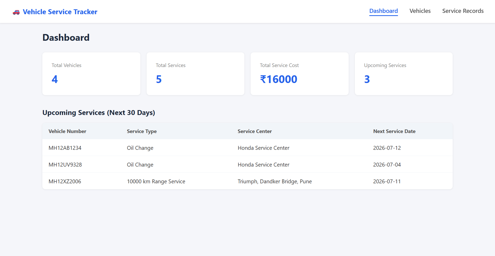
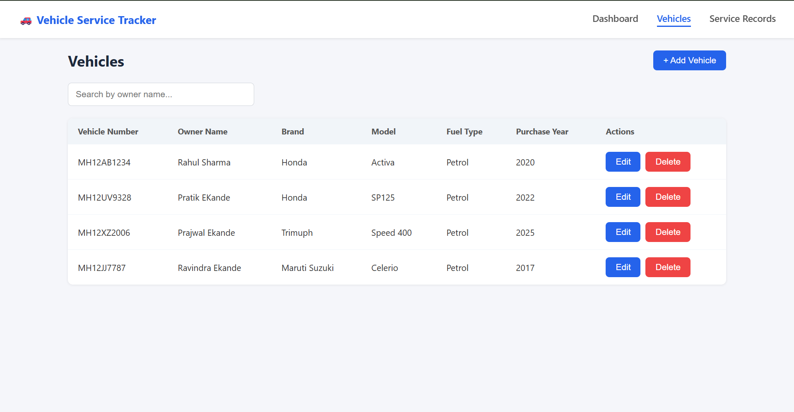
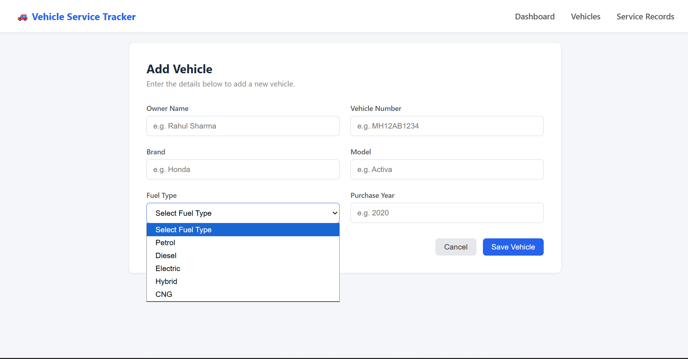
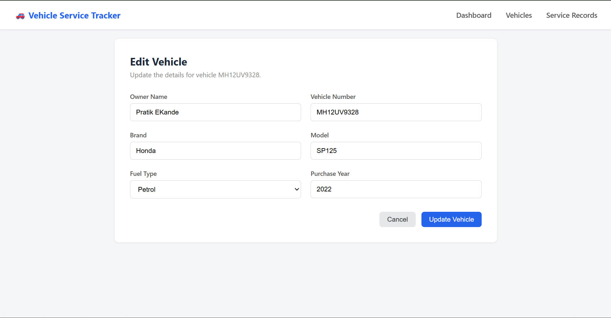
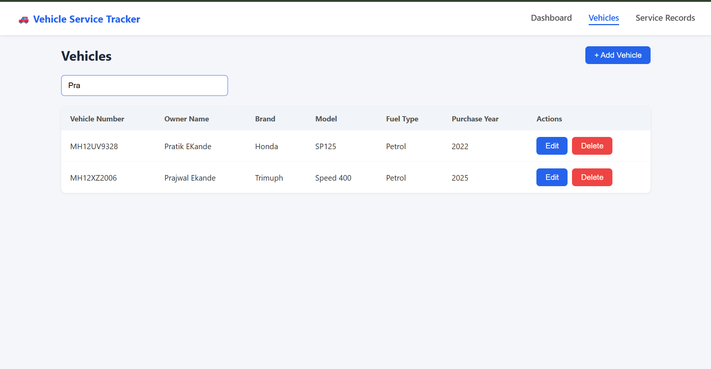
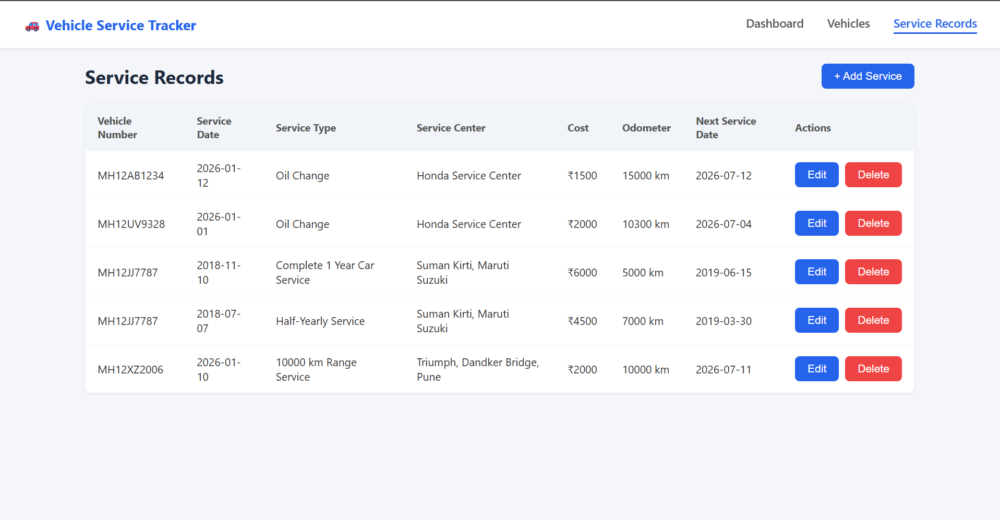
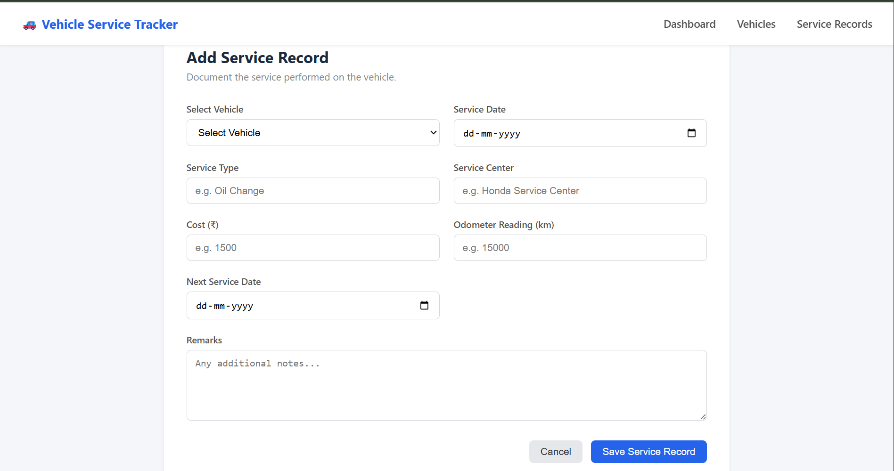
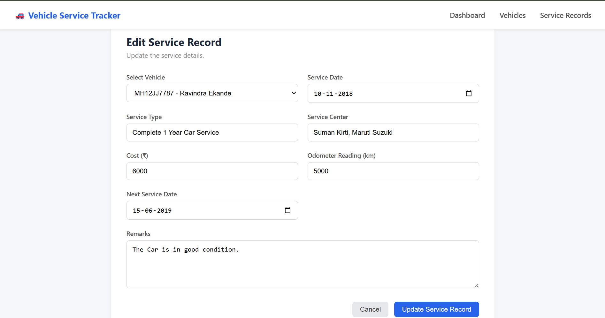

# 🚗 Vehicle Service Tracker

A full-stack vehicle maintenance management application built with Spring Boot and React.
Track vehicles, service records, costs and upcoming services with a clean dashboard.

---

## 🖼️ Screenshots

### Dashboard


### Vehicles
<table>
  <tr>
    <td></td>
    <td></td>
  </tr>
  <tr>
    <td></td>
    <td></td>
  </tr>
</table>

### Service Records
<table>
  <tr>
    <td></td>
    <td></td>
  </tr>
  <tr>
    <td></td>
  </tr>
</table>

---

## About

Vehicle Service Tracker is a vehicle maintenance management application where users can register
their vehicles, log service records for each vehicle, track service costs, and get a
complete overview through the dashboard showing total vehicles, total services, total cost
and upcoming services due in the next 30 days.

All data is stored in a MySQL database. The backend is built on Spring Boot following a
layered architecture with Controller, Service, Repository and Entity layers with REST APIs.
The frontend is built with React using Axios for API calls and React Router for navigation.

---

## Features

**Dashboard** — Summary cards for Total Vehicles, Total Services, Total Service Cost and
Upcoming Services count. Upcoming Services table showing vehicles due for service in the
next 30 days.

**Vehicles** — Add, edit and delete vehicles. Search vehicles by owner name. Each vehicle
has Owner Name, Vehicle Number, Brand, Model, Fuel Type and Purchase Year.

**Service Records** — Add, edit and delete service records. Each record is linked to a
vehicle and contains Service Date, Service Type, Service Center, Cost, Odometer Reading,
Next Service Date and Remarks.

---

## Tech Stack

| | |
|---|---|
| Backend | Spring Boot 3.3, Java 17 |
| Architecture | REST API |
| Database | MySQL 8.0 |
| ORM | Spring Data JPA, Hibernate |
| Frontend | React (Vite) |
| HTTP Client | Axios |
| Routing | React Router DOM |
| Styling | Plain CSS |
| Build | Maven |

---

## Project Structure

### Backend

src/main/java/org/example/vehicleservicetracker/
│
├── entity/
│   ├── Vehicle.java
│   └── ServiceRecord.java
│
├── repository/
│   ├── VehicleRepository.java
│   └── ServiceRecordRepository.java
│
├── dto/
│   ├── VehicleDTO.java
│   ├── ServiceRecordDTO.java
│   └── DashboardDTO.java
│
├── service/
│   ├── VehicleService.java
│   └── ServiceRecordService.java
│
├── controller/
│   ├── VehicleController.java
│   └── ServiceRecordController.java
│
├── exception/
│   ├── ResourceNotFoundException.java
│   └── GlobalExceptionHandler.java
│
└── VehicleServiceTrackerApplication.java

### Frontend

src/
│
├── api/
│   └── api.js
│
├── components/
│   └── Navbar.jsx
│
├── pages/
│   ├── Dashboard.jsx
│   ├── VehicleList.jsx
│   ├── AddVehicle.jsx
│   ├── EditVehicle.jsx
│   ├── ServiceHistory.jsx
│   ├── AddService.jsx
│   └── EditService.jsx
│
├── styles/
│   ├── App.css
│   ├── Navbar.css
│   ├── Dashboard.css
│   ├── VehicleList.css
│   ├── Form.css
│   └── ServiceHistory.css
│
└── App.jsx

---

## Database

Two tables are auto-created by Hibernate on first run.

**vehicles** — id, owner_name, vehicle_number, brand, model, fuel_type, purchase_year

**service_records** — id, vehicle_id (FK → vehicles), service_date, service_type,
service_center, cost, odometer_reading, next_service_date, remarks

---

## REST API Endpoints

### Vehicle APIs
| Method | Endpoint | Description |
|--------|----------|-------------|
| GET | /api/vehicles | Get all vehicles |
| GET | /api/vehicles/{id} | Get vehicle by ID |
| POST | /api/vehicles | Add new vehicle |
| PUT | /api/vehicles/{id} | Update vehicle |
| DELETE | /api/vehicles/{id} | Delete vehicle |
| GET | /api/vehicles/search/owner?ownerName= | Search by owner name |
| GET | /api/vehicles/search/vehicle-number?vehicleNumber= | Search by vehicle number |
| GET | /api/vehicles/search/brand?brand= | Search by brand |

### Service Record APIs
| Method | Endpoint | Description |
|--------|----------|-------------|
| GET | /api/services | Get all service records |
| GET | /api/services/{id} | Get service record by ID |
| POST | /api/services | Add new service record |
| PUT | /api/services/{id} | Update service record |
| DELETE | /api/services/{id} | Delete service record |
| GET | /api/services/vehicle/{vehicleId} | Get records by vehicle |
| GET | /api/services/dashboard | Get dashboard summary |

---

## Running Locally

### Backend

**1. Create the database**
```sql
CREATE DATABASE vehicle_service_db;
```

**2. Update application.properties**
```properties
spring.datasource.url=jdbc:mysql://localhost:3306/vehicle_service_db
spring.datasource.username=your_username
spring.datasource.password=your_password
spring.jpa.hibernate.ddl-auto=update
spring.jpa.show-sql=true
spring.jpa.open-in-view=false
server.port=8080
```

**3. Run**
```bash
mvn spring-boot:run
```

### Frontend

**1. Install dependencies**
```bash
cd frontend/vehicle-service-management
npm install
```

**2. Run**
```bash
npm run dev
```

**3. Open browser**
http://localhost:5173

No manual SQL scripts needed. Tables are created automatically on first run.

---

## Spring Boot Concepts Covered

- `@RestController`, `@RequestMapping`, `@GetMapping`, `@PostMapping`, `@PutMapping`, `@DeleteMapping`
- `@Entity`, `@OneToMany`, `@ManyToOne`, `@JoinColumn`, `@GeneratedValue`
- `JpaRepository` with built-in CRUD and derived query methods
- DTO pattern — separating Entity from API response
- `@PathVariable`, `@RequestParam`, `@RequestBody`
- `ResponseEntity` for HTTP response control
- `@RestControllerAdvice`, `@ExceptionHandler` for global exception handling
- `CascadeType.ALL`, `orphanRemoval` for relationship management
- `@Query` for custom JPQL queries
- `@CrossOrigin` for React-Spring Boot communication
- MVC Architecture — Controller → Service → Repository → Entity

---

## Note

Single-user application with no authentication.
Spring Security login can be added as a future enhancement.

---

**Pratik** — Java Developer